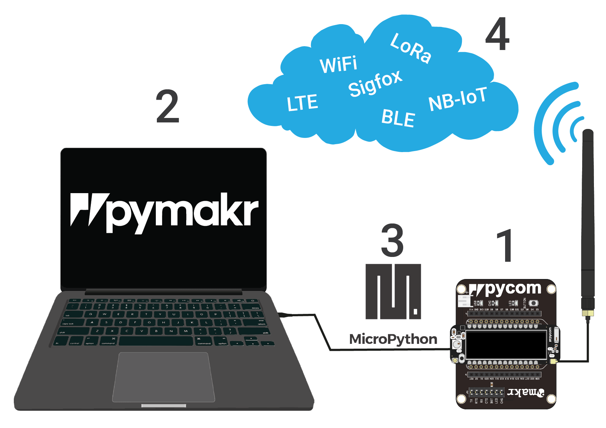

# Welcome
Pycom ecosystem makes IoT development easy.

* Choose [IoT hardware](products.md) which fit your project requirements.
 
* Install Pymakr plugin in [Atom](https://atom.io/packages/pymakr) or [VS Code](https://marketplace.visualstudio.com/items?itemName=pycom.Pymakr) and start with your IoT project in seconds.

* Write [MicroPython](https://micropython.org/) code and up to three times faster compared to C/C++.

* Send data to [Pybytes IoT platform](https://pybytes.pycom.io/?utm_source=docs&utm_medium=web&utm_campaign=getting-started-top) or use your device standalone with the range of supported networks. 

## [Setting up the hardware](gettingstarted/connection/README.md)
Firstly we will cover how to connect the module to your computer either via USB or WiFi.
Secondly, we will explain how to connect various accessories such as antennas or SIM cards to your module.

## [Setting up your computer and Pymakr plugin](gettingstarted/installation/README.md)
You will need to install some software on your computer to interface with it.
The second part of this guide will guide you through installing drivers and performing firmware updates for your module/accessories.
And how to set up the Pymakr plugins and other software use to program your device.

## [MicroPython crash course](gettingstarted/programming/README.md)
Now that you have a connected module and all the required software installed it is time to begin programming your device.
This part of the guide will get you started with a basic example and point you in the right direction for getting your device connected to your chosen network.

## [Connecting to Pybytes IoT platform](pybytes/introduction.md)
Connect your device to [Pybytes](https://pybytes.pycom.io/?utm_source=docs&utm_medium=web&utm_campaign=getting-started-bottom) with Wi-Fi, LoRa or Sigfox. Send data from your device just with one line command.
Update your firmware over the air and integrate with third-party services like AWS.

## [Connecting to your custom IoT platform](gettingstarted/registration/README.md)
Connect your device to your own IoT platform with one of the advertised wireless networks.
This usually requires some registration. This step will detail how to get registered and connected to various wireless networks.

# Quick navigation
* [Products](products.md)
* [Getting Started](gettingstarted/introduction.md)
* [Pymakr](pymakr/installation/index.html)
* [Tutorials](tutorials/introduction.md)
* [API Documentation](firmwareapi/introduction.md)
* [Product Info](datasheets/introduction.md)
* [Pybytes](pybytes/introduction.md)
