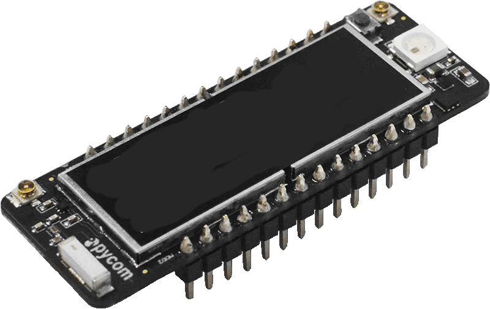
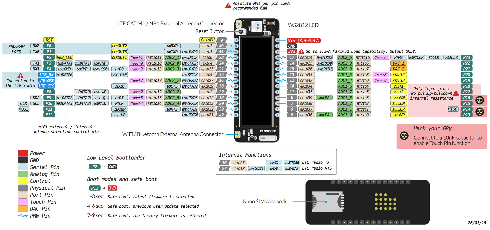

# GPy

 


 ** Please Note: We have removed the labels from the pictures in the documentation due to inconsistencies with label orientation.  *The LED must be aligned above the USB socket* when inserting or removing a development board from an expansion board/Pytrack/Pysense/Pyscan. **


**Store**: [Buy Here](https://pycom.io/product/gpy)

**Getting Started:** [Click Here](../../gettingstarted/connection/gpy.md)

## Datasheet


Please Note: We have removed the labels from the pictures in the documentation due to inconsistencies with label orientation.  *The LED must be aligned above the USB socket* when inserting or removing a development board from an expansion board/Pytrack/Pysense/Pyscan.


The datasheet of the GPy is available as a PDF File.

<a href="../../.gitbook/assets/specsheets/Pycom_002_Specsheets_GPy_v2.pdf" target="_blank"> GPy Datasheet </a>

The drawing of the LTE-M antenna is available as a PDF File.

<a href="../../.gitbook/assets/lte-m-antenna-drawing.pdf" target="_blank"> LTE-M Antenna Drawing </a>

## Pinout

The pinout of the GPy is available as a PDF File

<a href="../../.gitbook/assets/gpy-pinout.pdf" target="_blank"> GPy Pinout </a>


Please note that the PIN assignments for UART1 \(TX1/RX1\), SPI \(CLK, MOSI, MISO\) and I2C \(SDA, SCL\) are defaults and can be changed in Software.


## Notes

### WiFi

By default, upon boot the GPy will create a WiFi access point with the SSID `gpy-wlan-XXXX`, where `XXXX` is a random 4-digit number, and the password `www.pycom.io`.

The RF switch that selects between the on-board and external antenna is connected to `P12`, for this reason using `P12` should be avoided unless WiFi is disabled in your application.

### Power

The `Vin` pin on the GPy can be supplied with a voltage ranging from `3.5v` to `5.5v`. The `3.3v` pin on the other hand is output **only**, and must not be used to feed power into the GPy, otherwise the on-board regulator will be damaged.

### AT Commands

The AT commands for the Sequans Monarch modem on the GPy are available in a PDF file.

[AT Commands for Sequans](../../.gitbook/assets/monarch_4g-ez_lr5110_atcommands_referencemanual_rev3_noconfidential-1.pdf)

## Tutorials

Tutorials on how to the GPy module can be found in the [examples](../../tutorials/introduction.md) section of this documentation. The following tutorials might be of specific interest for the GPy:

* [WiFi connection](../../tutorials/all/wlan.md)
* [LTE CAT-M1](../../tutorials/lte/cat-m1.md)
* [NB-IoT](../../tutorials/lte/nb-iot.md)
* [BLE](../../tutorials/all/ble.md)

