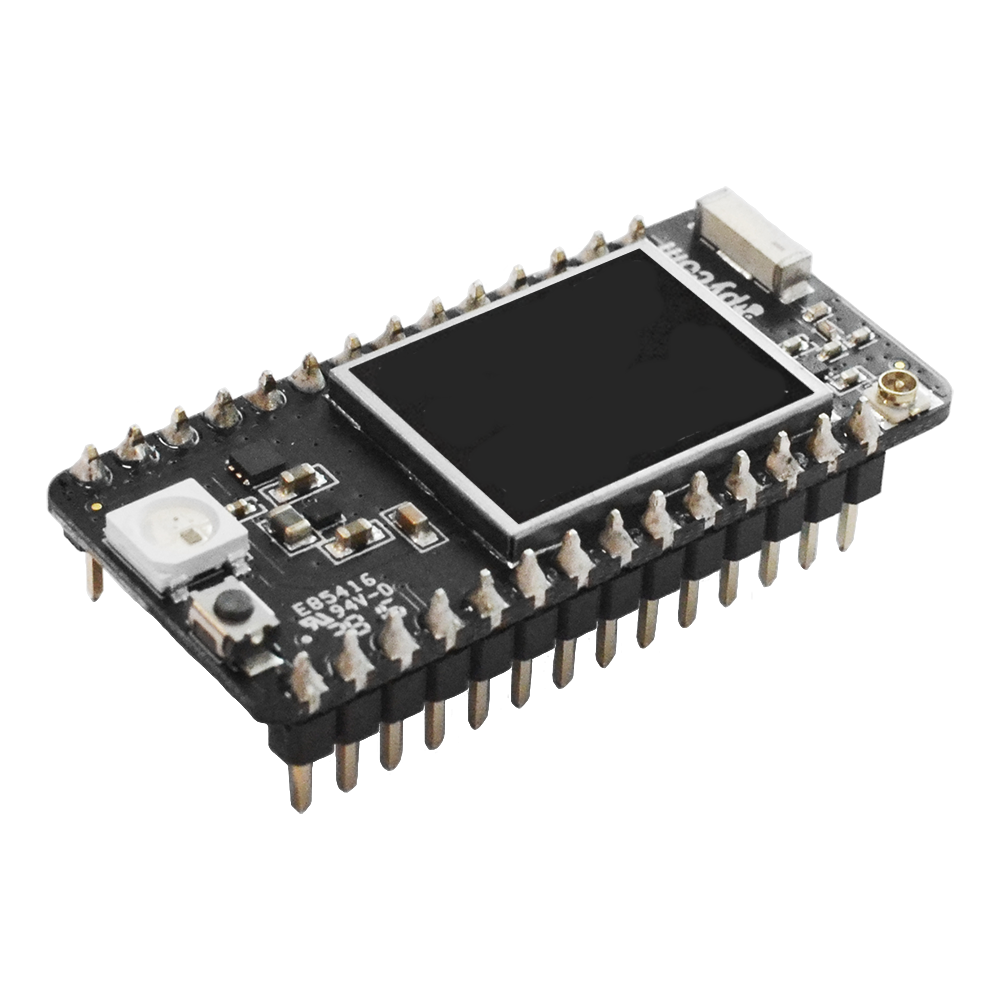
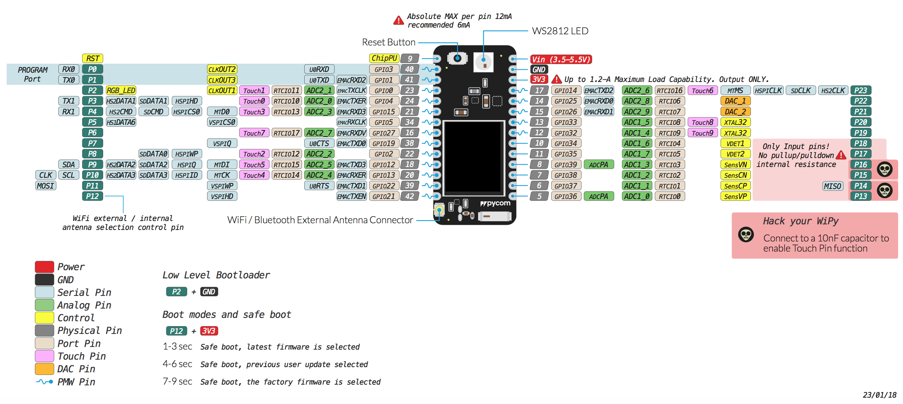

# WiPy 3.0

 


 ** Please Note: We have removed the labels from the pictures in the documentation due to inconsistencies with label orientation.  *The LED must be aligned above the USB socket* when inserting or removing a development board from an expansion board/Pytrack/Pysense/Pyscan. **


**Store**: [Buy Here](https://pycom.io/product/wipy-3-0/)

**Getting Started:** [Click Here](../../gettingstarted/connection/wipy.md)

## Datasheet

The datasheet of the WiPy3 is available as a PDF File.

[WiPy3 Datasheet](../../.gitbook/assets/wipy3-specsheet.pdf)

## Pinout

The pinout of the WiPy3 is available as a PDF File.

[WiPy3 Pinout](../../.gitbook/assets/wipy3-pinout.pdf)


Please note that the PIN assignments for UART1 \(TX1/RX1\), SPI \(CLK, MOSI, MISO\) and I2C \(SDA, SCL\) are defaults and can be changed in Software.


## Differences from WiPy 2.0

* Deep sleep current draw fixed, now only 19.7µA
* Upgraded RAM from 512KB to 4MB
* Upgraded External FLASH from 4MB to 8MB
* Antenna select pin moved from GPIO16 to GPIO21 \(P12\)

## Notes

### WiFi

By default, upon boot the WiPy3 will create a WiFi access point with the SSID `wipy-wlan-XXXX`, where `XXXX` is a random 4-digit number, and the password `www.pycom.io`.

The RF switch that selects between the on-board and external antenna is connected to `P12`, for this reason using `P12` should be avoided unless WiFi is disabled in your application.

### Power

The `Vin` pin on the WiPy3 can be supplied with a voltage ranging from `3.5v` to `5.5v`. The `3.3v` pin on the other hand is output **only**, and must not be used to feed power into the WiPy3, otherwise the on-board regulator will be damaged.

## Tutorials

Tutorials on how to the WiPy3 module can be found in the [examples](../../tutorials/introduction.md) section of this documentation. The following tutorials might be of specific interest for the WiPy3:

* [WiFi connection](../../tutorials/all/wlan.md)
* [BLE](../../tutorials/all/ble.md)

