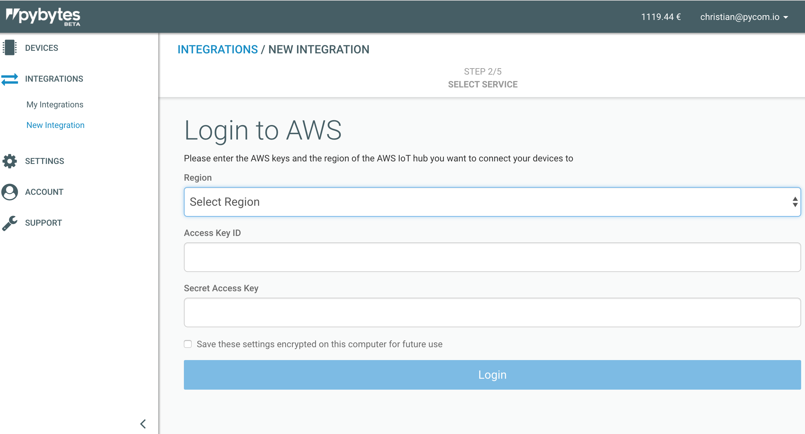
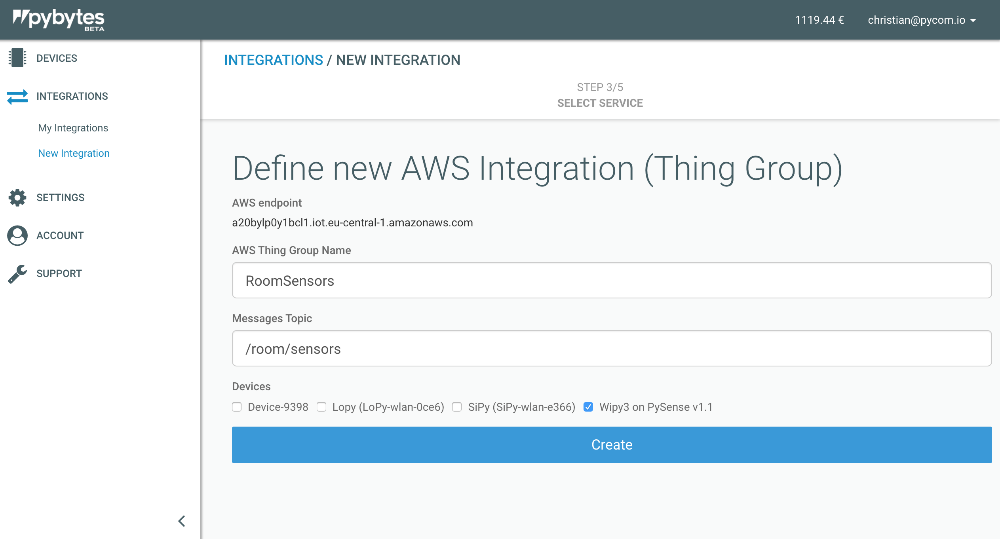
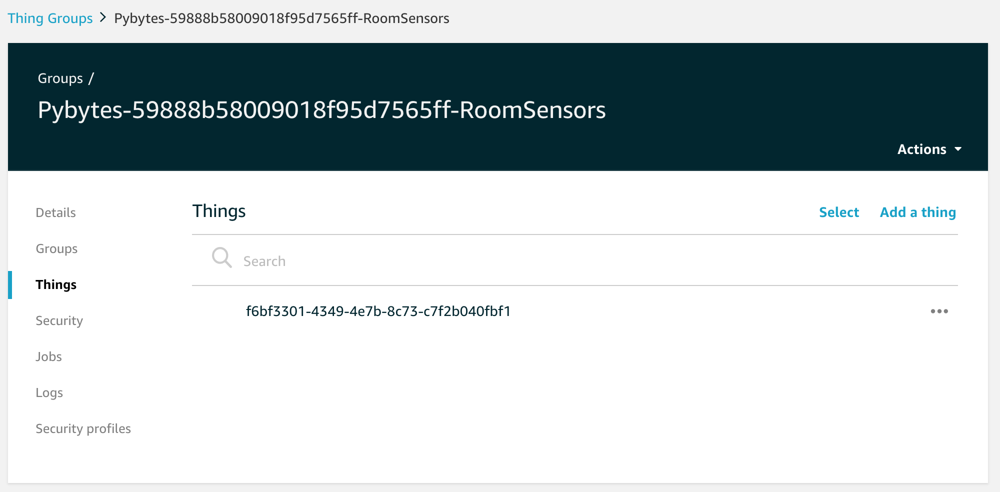

# Amazon IoT

Whenever one of your integrated devices sends a signal to our broker, we republish the binary payload to the endpoint specified for its integration.

## Integrate your devices

1. Go in the sidebar, click on _New Integration_ and then on _Amazon Web Services_

2. Fill in the form choosing an [AWS region](https://docs.aws.amazon.com/AWSEC2/latest/UserGuide/using-regions-availability-zones.html) and your AWS credentials. You can optionally choose to save them inside the local storage for future use. Once you're done, click _Login_

3. In this step, you have to specify the [AWS group](https://docs.aws.amazon.com/iot/latest/developerguide/thing-groups.html) name \(just alphanumeric letter, dashes and underscore are allowed\), the custom topic and the devices you want to bind to AWS. When you're ready, click _Create_

4. If everything's worked as expected, you should be able to see a summary of your integration like the following:

5. The corresponding AWS Thing and AWS Group has been created as well, you just have to [log in to the console](https://console.aws.amazon.com/console/home?nc2=h_ct&src=header-signin) and choose the same region of your devices from the topbar. You'll be able to explore groups and things' details.

6. The device's name is specified as an attribute of the thing.

## Final considerations

In order to save the data received by AWS, [you must set up a rule](https://docs.aws.amazon.com/iot/latest/developerguide/iot-rules.html). You can also test that everything's working with the [AWS IoT MQTT client](https://docs.aws.amazon.com/iot/latest/developerguide/view-mqtt-messages.html). Please notice that it's not possible to download the private key from AWS once it has been generated, by the way we securely store it inside our database. We may consider to allow its download in the future, so that you could also directly send your device to AWS, by passing Pybytes.

**Warning**: do not delete AWS things or groups directly from AWS user interface, otherwise the integration with Pybytes will stop working. Always use Pybytes interface to delete AWS things or groups.
