# Lorawan OTA update


Lorawan is a low-power wide-area (LPWA) network protocol that connects millions of devices around the globe. This technology offers long range, low power, secure communications, however, at much lower data rates than traditional networks such as Wi-Fi. In this tutorial we show how to perform a fast, reliable, over-the-air (OTA) update of the **text files (.py, .js, .txt, etc) residing in flash.**

## Getting Started

This project is based on a client-server architecture. On the server side the [loraserver](https://www.loraserver.io) and the mosquitto MQTT server are used to send data between the updater application and the connected devices. The updater interfaces with the loraserver MQTT using the [paho-mqtt] (https://pypi.org/project/paho-mqtt/) client. The Python libraries and sample code for the OTA updater are available at the following [Github Repository](https://github.com/pycom/pycom-libraries/tree/master/examples/OTA-lorawan).

### Server setup

* Install the [loraserver](https://www.loraserver.io/overview/). In this tutorial we will install the [docker](https://www.loraserver.io/guides/docker-compose/) version on Linux.
* Navigate to the loraserver-docker/configuration/loraserver folder and open the loraserver.toml file. Update the following LoraWAN regional parameters as indicated:

```
name="Your region" E.g "EU_863_870" for Europe 
rx_window=2
rx2_dr="Choose one with a payload of 200 bytes or more" E.g 5 for Europe
```

An example configuration file with parameter description can be found [here](https://www.loraserver.io/loraserver/install/config/). The lora-app-server, lora-gateway-bridge and lora-geo-server configuration files can be left to their default values.

* Run the following command to create all docker containers and start the loraserver:

```
$ sudo docker-compose up
```

* Open a web-browser and use http://localhost:8080 (https if certificates configured) to access the Loraserver web-interface. 
* Login to loraserver using admin for both user and password.

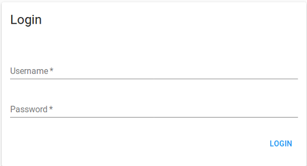

* Now you should be able to see the Loraserver web-interface shown below.

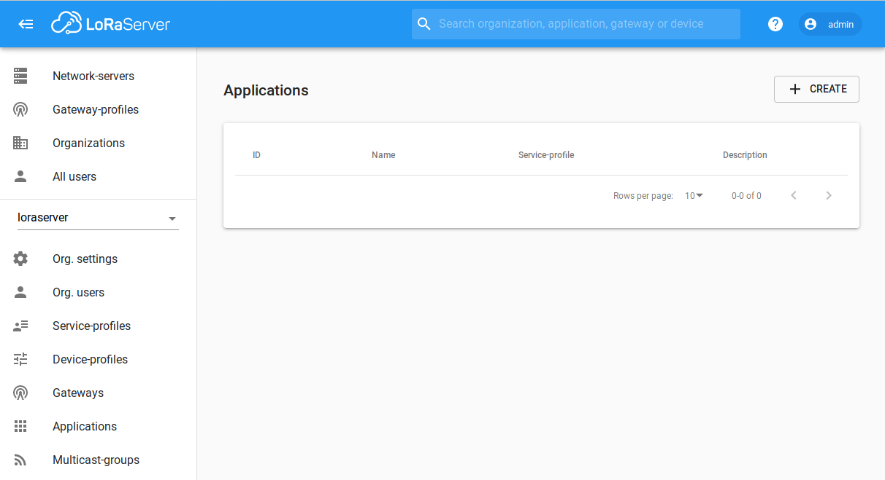

* Click on Network-servers and press Add. Enter a network-server name and loraserver:8000 as network-server server.

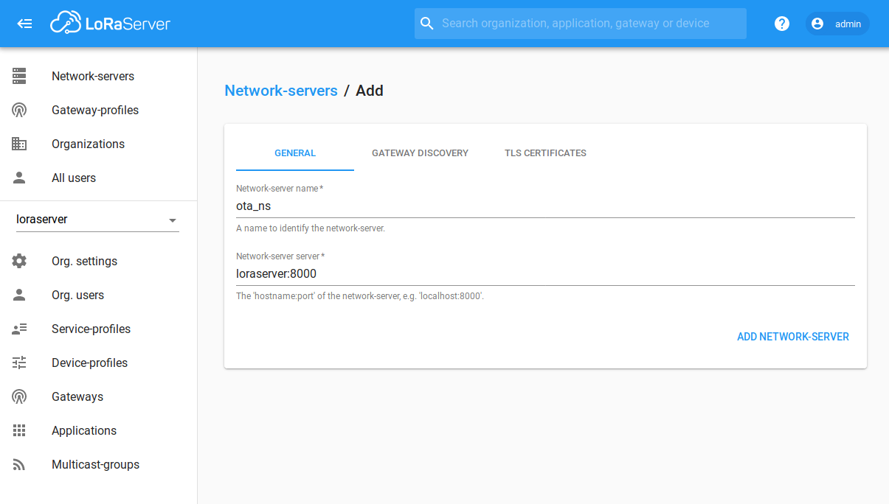

* Click on the Gateway-profiles and press create. Give this profile a name, select the channels enabled for this channel, and choose the network-server just created.

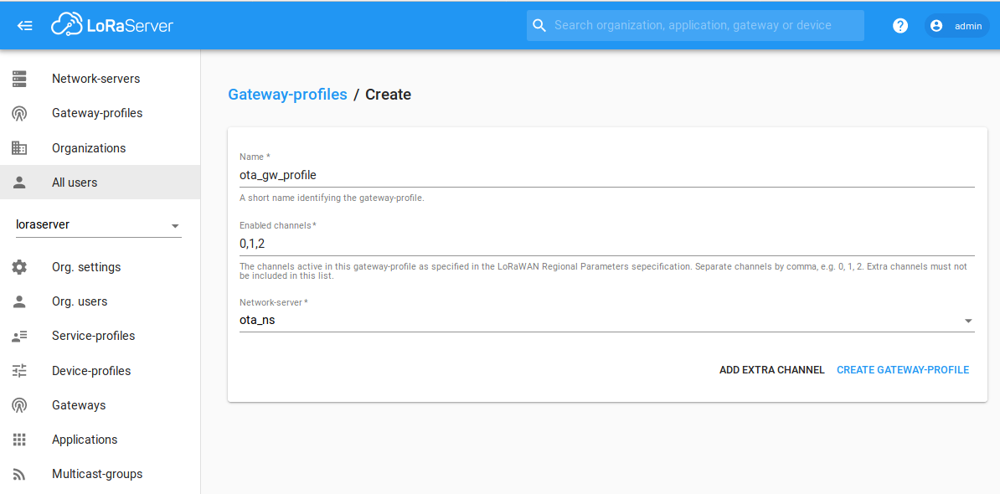

* Click on the Gateways and press create. Choose a gateway name a fill the description field. Read the gateway ID from your lora gateway and choose the network-server and gateway-profile just created. Check the gateway discovery enabled checkbox.

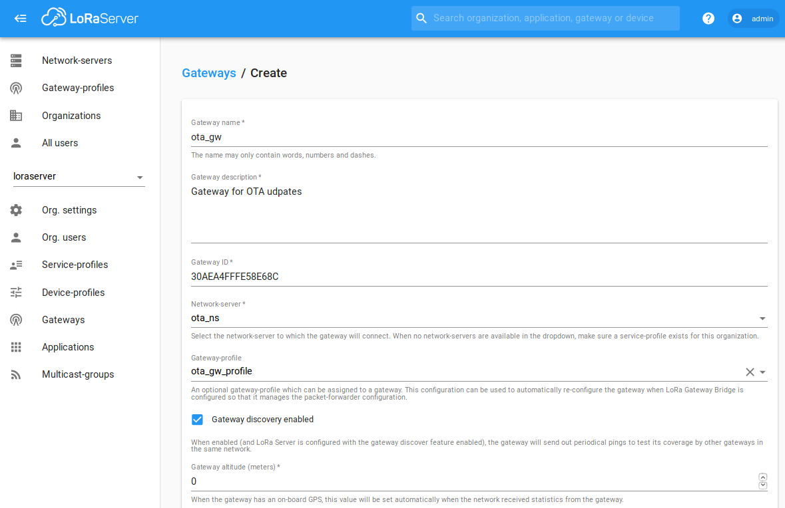

* Click on service-profile and then press create. Choose a service-profile name, select the network-server we created before and click the Add gateway meta-data checkbox.

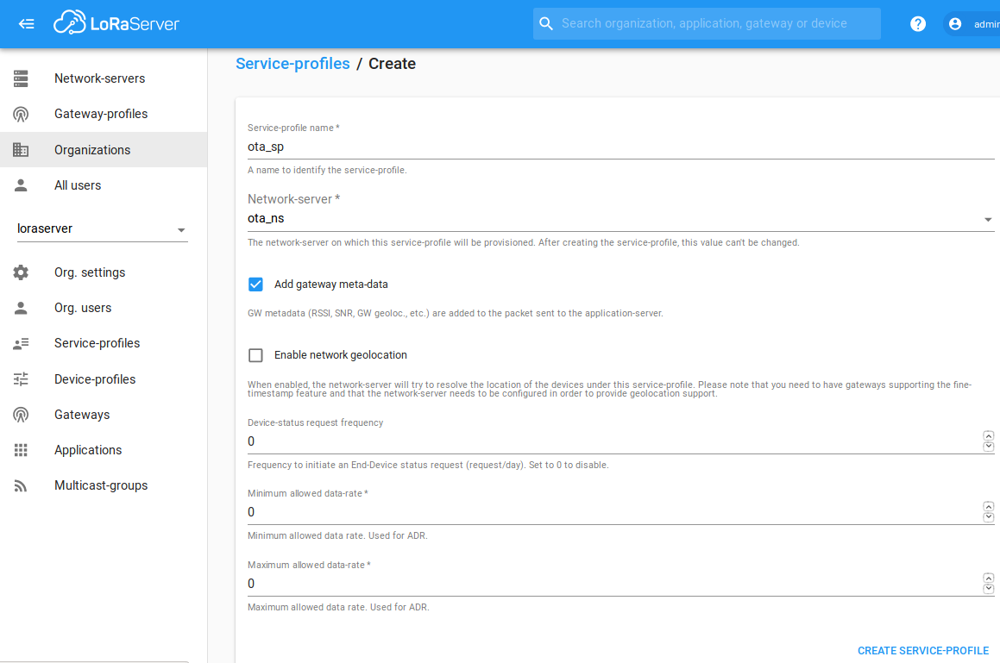

* Click on Device-profile and then press the create button. In the general tab, input a device-profile name, select 1.0.2 from the Lorawan Mac version menu and select B from the Lorawan Regional parameters revision field.

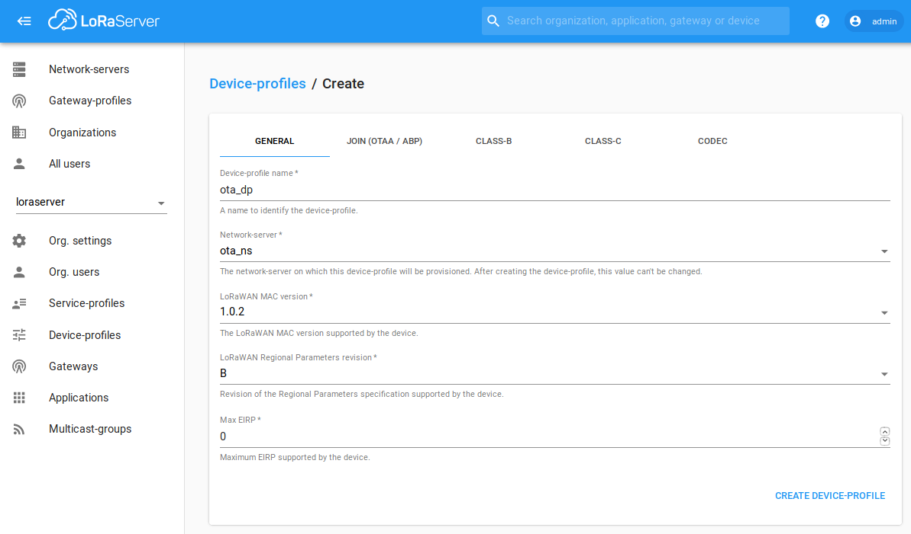

In the Join tab, select the Device supports OTAA check box otherwise ABP will be chosen automatically. If you prefer ABP, you need to fill the RX1 delay, RX2 data-rate and RX2 channel frequency parameters.

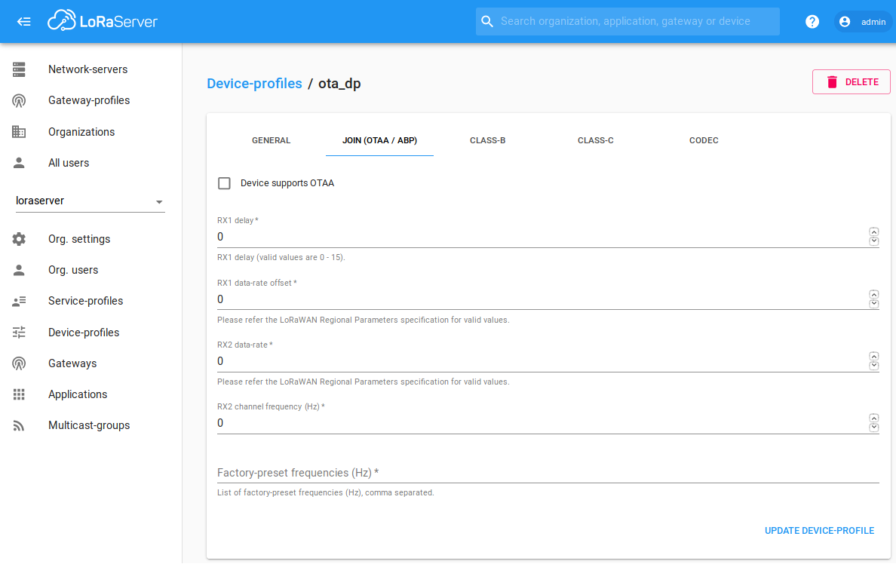

In the class C tab, please select Device supports Class-C checkbox. 

* Click on Applications and then press create. Input an application name and an application description. From the dropdown menu choose the service-profile we created previoulsy.

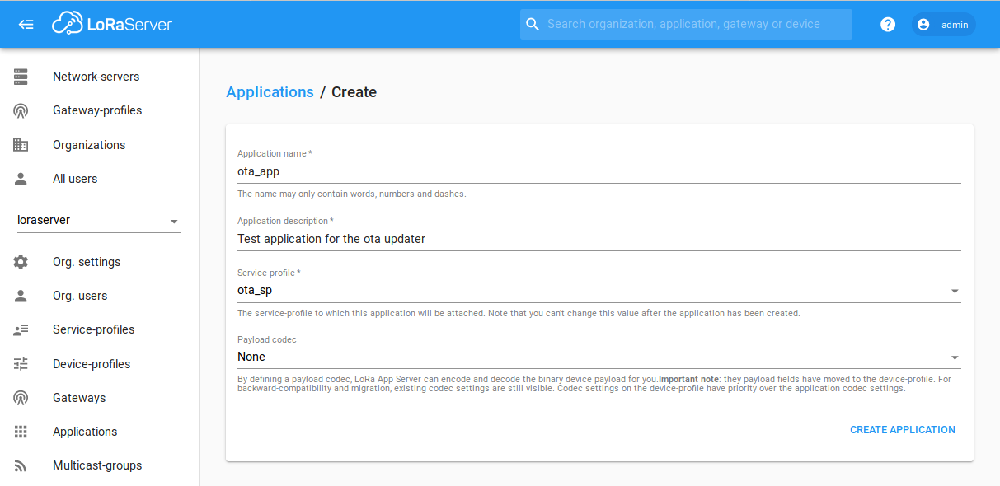

Click on the application just created and in the devices tab, select create. Select a device name, device description and a device EUI. From the device-profile dropdown menu select the device-profile create in the previous steps.

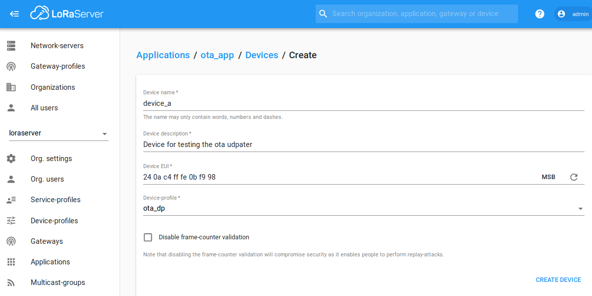

In the keys tab, generate the application keys. 

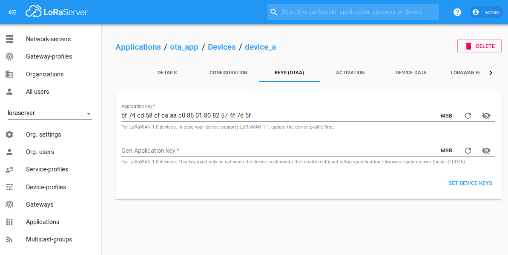

* Clone or download the OTA updater from the following [Github Repository](https://github.com/pycom/pycom-libraries/tree/master/examples/OTA-lorawan).

* The server side code requires Python 3. To determine whether you have Python 3 installed, type the following:

```
$ python3 -V
```

* Install the paho mqtt client using:

```
$ pip3 install paho-mqtt
``` 

* ** Update the python config file parameters with the values from the previous steps. ** 

* Start the OTA updater service using the following:

```
$ python3 updaterService.py
```


